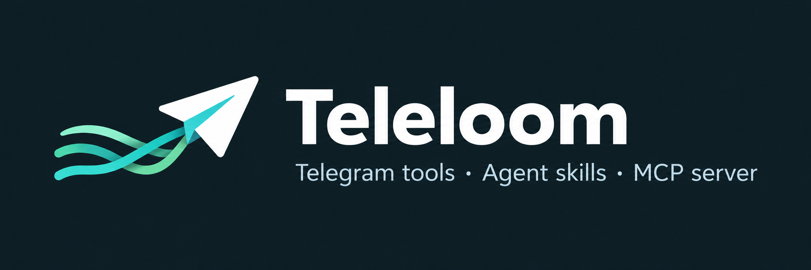

<p align="center"></p>

<p align="center"><strong>Your Telegram, ready for agents.</strong><br>
A Telegram toolkit with portable agent skills, an MCP server and a CLI.</p>

<p align="center">
<a href="https://github.com/starsinc1708/teleloom/releases"></a>
<a href="LICENSE"></a>
<a href="pyproject.toml"></a>
<a href="skills"></a>
<a href="docs/reference.md"></a>
<a href="https://github.com/starsinc1708/teleloom/actions/workflows/ci.yml"></a>
</p>

<p align="center"><a href="docs/getting-started.md">Get started</a> · <a href="README.ru.md">Русский</a> · <a href="docs/clients.md">Clients</a> · <a href="docs/workflows.md">Example tasks</a> · <a href="docs/agent-guide.md">For agents</a></p>

Teleloom connects your Telegram accounts and bots to the agent you already use.
Find messages across chats, catch up on discussions, build summaries with source
links, inspect documents, and prepare actions you can review before they run.

One local owner manages connections and state. Multiple agent clients share it;
you choose the accessible chats and the permissions for each account.

## What you can do

| Task | What Teleloom provides |
|---|---|
| Catch up | Read history, search messages and authors, follow replies and topics, review unread messages |
| Research many chats | Bounded collection jobs, frozen originals, counters, excerpts, exports and explicit coverage gaps |
| Write a verifiable digest | Stable evidence references, source links, claim/revision validation and portable digest instructions |
| Work with media | Photos, rich text, documents/PDF, optional OCR and opt-in transcription |
| Act with control | Preview and confirm messages, replies, media, bounded broadcasts, and supported account/group changes |
| Keep context manageable | Reusable field selection, compact views, output budgets and access to the exact originals |

**67 MCP tools and six portable skills:** connect, read, inbox, digest, send and
broadcast. See the [tool reference](docs/reference.md) for exact contracts and limits.

## Quick start

Requires Git, [uv](https://docs.astral.sh/uv/) and Python 3.12–3.14.
User accounts need your own Telegram API ID/hash from [my.telegram.org](https://my.telegram.org).
Bots use a bot token. Credentials are entered locally, outside an agent conversation.

```sh
git clone --single-branch https://github.com/starsinc1708/teleloom.git
cd teleloom
uv sync --frozen
uv run teleloom init
uv run teleloom auth user --profile personal --ui browser
uv run teleloom profile list
```

On your phone, open **Telegram → Settings → Devices → Link Desktop Device** and
scan the QR. A working OS credential store is required to save the session.
For headless hosts, bots, read restrictions and first-use troubleshooting, follow
the [English guide](docs/getting-started.md) or [Russian guide](docs/install-ru.md).

Connect a client and install its skills:

```sh
uv run teleloom config client --client codex
uv run teleloom skills install --client codex
```

Merge the printed fragment into the existing client configuration, then reconnect
MCP. Use `claude`, `opencode` (v2), `opencode-v1`, `hermes` or `pi` for other clients.
Existing skills are preserved unless you explicitly request replacement.
[Client paths and discovery checks](docs/clients.md).

For OpenCode 2 or Hermes, register MCP through the installed client's CLI:

```sh
uv run teleloom config client --client opencode --install
uv run teleloom skills install --client opencode
uv run teleloom config client --client hermes --install
uv run teleloom skills install --client hermes
```

Choose the pair for your client, then reconnect MCP (`opencode reload` for a running
OpenCode service). `--install` is available in
the current source checkout; v0.5.0 only prints fragments. An identical connection
is preserved; a conflicting `teleloom` entry requires manual review. Hermes skills
follow `hermes config path`, including its active profile and `HERMES_HOME`.

Try this first:

> Check server status and list profiles. Ask me to select a profile and one chat.
> Read its latest 20 messages without marking them as read. Summarize the main
> topics with message links and state any missing context. Do not send messages
> or change settings or permissions.

## Control and privacy

- New profiles can read all chats accessible to the account. Use **selected read
  policy** to restrict access; the [setup guide](docs/getting-started.md#restrict-access)
  explains the independent tool and chat gates.
- Sending and other external changes require their own permissions and an
  immutable preview plus confirmation. An uncertain delivery is recorded as
  **unknown** and is never automatically resent.
- Telegram credentials stay in the OS keyring or supplied environment. State and
  exports stay in your local data directory. Your chosen agent/model provider
  receives the evidence you request; optional external analysis is explicit.
- Reading does not acknowledge messages. Bot history covers collected observations,
  and search/digest results disclose their scope and gaps.

The confirmation flag is trusted input from your agent client; it is not independent
proof of a human approval. All local clients share one trusted OS owner.
[Security model and vulnerability reporting](SECURITY.md).

## Clients and optional features

| Client | Integration |
|---|---|
| Codex | Stdio MCP and six portable skills |
| Claude Code | Stdio MCP and six portable skills |
| OpenCode 2 / 1 | Native MCP configuration; separate version targets |
| Hermes | Native `mcp_servers` configuration and skills |
| Pi | Native `mcpServers` configuration and skills |
| Claude Desktop | MCP configuration; GUI behavior remains unverified |
| Other MCP hosts | Stdio or authenticated loopback Streamable HTTP |

Optional extras: `pdf`, `ocr`, `transcription` and `jev`. Start with the base
installation; enable only the engines you need. [Media](docs/media.md),
[attachments](docs/attachments.md), [deployment](docs/deployment.md).
Native connection observations and testing limits are recorded in
[acceptance](docs/acceptance.md); discovery does not establish model workflow quality.

## Develop and contribute

Report reproducible bugs and propose workflows in [Issues](https://github.com/starsinc1708/teleloom/issues).
Read [CONTRIBUTING](CONTRIBUTING.md); coding agents start with [AGENTS.md](AGENTS.md).
Run checks for the behavior you change. A substantial release gets one full run,
one canonical build and artifact identity verification.

Teleloom **v0.5.0 is the first public release**, published with a fresh Git history.
The Python package, module, CLI and MCP server are named `teleloom`; runtime
skills use the `teleloom-` prefix.
Install from this repository or its [release artifacts](https://github.com/starsinc1708/teleloom/releases);
no PyPI distribution is claimed. [Changelog](CHANGELOG.md) · [Documentation](docs/README.md).

MIT licensed. Inspired by [chigwell/telegram-mcp](https://github.com/chigwell/telegram-mcp),
implemented independently. Teleloom is an independent project, unaffiliated with Telegram.
