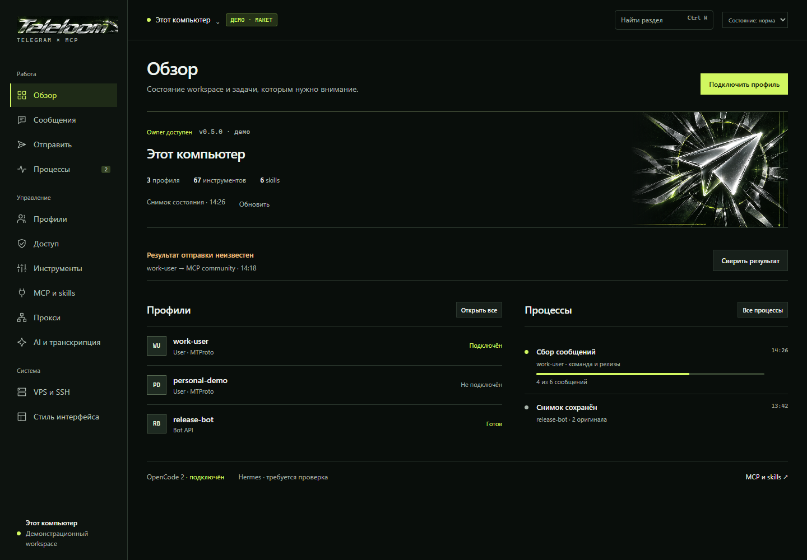

# Browser GUI design concept

The owner requested page mockups in the visual language of
[teleloom.png](../assets/teleloom.png). [Design task #33](https://github.com/starsinc1708/teleloom/issues/33)
covers the clickable prototype; implementation remains in GUI issues #20–#32.

Open [gui.html](gui.html) through a loopback static server from the repository root:

```powershell
uv run python -m http.server 8840 --bind 127.0.0.1
```

Then open `http://127.0.0.1:8840/docs/design/gui.html` in a browser. The prototype
uses native HTML/CSS/JavaScript, system fonts and the existing banner. There is
no frontend build step or new project dependency. The static server is for
reviewing these files, separate from the Teleloom owner.

## Design contract

This is an owner workspace for operating accounts, sources and exact actions.
Navigation stays stable; each page exposes its primary task and the next step.
The supplied wordmark and paper-plane artwork carry the brand. Owner status and
the unresolved receipt come before the profile/process lists. Counts stay in
the workspace identity row. Working surfaces are matte graphite with a single
lime action/selection accent; amber and rose have distinct warning/error roles.
Dense source records and process tables use quiet dividers. Forms, message
evidence and dialogs retain boundaries where they clarify the task.

The owner's anti-slop refinement uses `ui-taste` audit/distill/polish and the
grid/geometry guidance of `industrial-brutalist-ui`, adapted to the supplied
lime/chrome identity. It removes the promotional hero, equal counter tiles,
repeated panel frames, decorative status pills and slogan/issue-number labels.

| Role | Choice |
| --- | --- |
| Canvas / surface / raised | `#090e0b` / `#101713` / `#171f1a` |
| Accent / chrome | `#d1f760` / `#cdd6d0` |
| Primary / secondary text | `#eef3ef` / `#a8b4ab` |
| Typography | Segoe UI or system sans; Cascadia Code or system monospace |
| Scale | Heading 32/38; section 18/25; body 14/22; metadata 12 |
| Spacing | 4, 8, 12, 16, 24, 32 px |
| Corners | Straight edges on surfaces, controls and dialogs |
| Motion | Short state transitions; reduced motion disables animation |

Below 900 px, navigation becomes a drawer. Below 640 px, form/overview columns
stack, sources become a horizontal selector, and coverage moves below the
evidence. Tables scroll within their containers. Dialogs remain within the
viewport. Labels, visible keyboard focus, native modal focus management and a
skip link are included.

## Screens

The links select prototype routes when served locally. A search palette
(`Ctrl+K`, or `⌘+K`) also reaches every screen, including login flows.

| Screen | Prototype route | Implementation issue |
| --- | --- | --- |
| Owner overview | [Overview](gui.html#overview) | [#20](https://github.com/starsinc1708/teleloom/issues/20) |
| Profiles and diagnostics | [Profiles](gui.html#profiles) | [#21](https://github.com/starsinc1708/teleloom/issues/21) |
| Jobs and receipts | [Processes](gui.html#jobs) | [#22](https://github.com/starsinc1708/teleloom/issues/22) |
| Tool exposure and restart review | [Tools](gui.html#tools) | [#23](https://github.com/starsinc1708/teleloom/issues/23) |
| User QR / 2FA login | [Account setup](gui.html#user-login) | [#24](https://github.com/starsinc1708/teleloom/issues/24) |
| Bot API setup | [Bot setup](gui.html#bot-login) | [#25](https://github.com/starsinc1708/teleloom/issues/25) |
| Read policy and distinct grants | [Permissions](gui.html#permissions) | [#26](https://github.com/starsinc1708/teleloom/issues/26) |
| OpenCode / Hermes and six skills | [Clients and skills](gui.html#integrations) | [#27](https://github.com/starsinc1708/teleloom/issues/27) |
| Named proxy catalog and assignment | [Proxies](gui.html#proxies) | [#28](https://github.com/starsinc1708/teleloom/issues/28) |
| Existing Jev / transcription engines | [AI and transcription](gui.html#engines) | [#29](https://github.com/starsinc1708/teleloom/issues/29) |
| Frozen evidence workspace | [Messages](gui.html#reading) | [#30](https://github.com/starsinc1708/teleloom/issues/30) |
| Compose, exact preview, confirmation | [Send](gui.html#compose) | [#31](https://github.com/starsinc1708/teleloom/issues/31) |
| Private SSH / VPS setup | [Remote workspace](gui.html#remote) | [#32](https://github.com/starsinc1708/teleloom/issues/32) |
| Palette, typography and components | [Style sheet](gui.html#design) | [#33](https://github.com/starsinc1708/teleloom/issues/33) |

## Review states

The top-right state selector exposes loading, empty and error/recovery views.
Profiles/jobs have filters. Messages support local fixture search, chat selection,
coverage tabs and source dialogs. Account setup demonstrates name validation,
a non-scannable QR placeholder, 2FA and success. Tool changes show a review diff
and update only in-memory demo selection. Compose displays a live draft, freezes
the exact preview, requires a separate confirmation and exposes a demo receipt
with an unknown-result recovery state.

Every page is labelled **ДЕМО · МАКЕТ**. Profiles, chats, content, jobs and results
are synthetic. No Teleloom, Telegram, SSH or AI APIs are called; credentials are
not persisted. CSP includes `connect-src 'none'` and disables form submission.
Security/ownership badges illustrate the proposed UI, not implemented browser
authentication or verified owner state. Most configuration forms demonstrate
review/results rather than maintaining a complete settings model. No GUI
implementation issue is completed by this design artifact.

## Screenshots

- [Owner overview](screenshots/overview.png)
- [Evidence workspace](screenshots/workspace.png)
- [Compose](screenshots/compose.png)
- [Confirmation](screenshots/confirmation.png)
- [Design tokens/components](screenshots/design.png)
- [Mobile overview](screenshots/mobile.png)



## Actual verification

On 7 October 2026, Chromium/Playwright exercised 76 prototype assertions:
42 route/viewport checks (14 screens at 1440, 900 and 390 px), state recovery,
filters, user/bot setup, local tool diff/apply, configuration reviews, frozen
evidence search/source/partial coverage, escaped and frozen send preview,
confirmation/unknown receipt, invalid SSH port, command palette, mobile drawer
and reduced motion. There were no JavaScript page errors. Recorded requests
were only the local HTML and the supplied banner; persistent storage stayed
empty. Representative desktop and mobile captures were visually inspected.

Palette contrast calculations: primary text/surface **16.21:1**, secondary
text/surface **8.48:1**, primary button text/accent **13.79:1**, input
boundary/surface **3.60:1**. These are targeted prototype checks, not runtime,
live Telegram, client-discovery or full accessibility acceptance.
