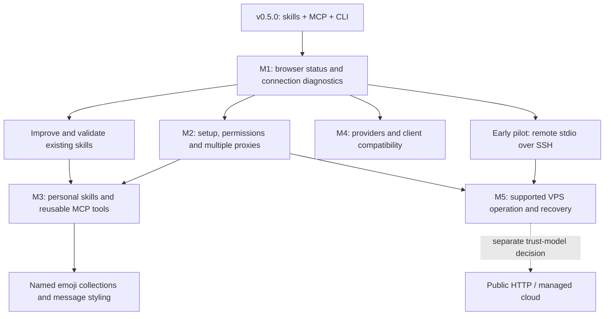

# Teleloom roadmap

Planning proposal, **7 October 2026**. Teleloom remains a Telegram toolkit with
portable agent skills, an MCP server and a CLI. The next direction is to make
that toolkit easier to configure, adapt and operate, starting with a browser GUI.
The owner requested both Telegram and AI provider improvements and selected a
self-hosted VPS over SSH as the first cloud scenario. [Planning issue #4](https://github.com/starsinc1708/teleloom/issues/4).

The directions below guide future scoped issues; they do not establish implemented
features, accepted security changes, release versions or delivery dates. Each
implementation issue needs a concrete workflow and the affected public checks
under the [implementation standards](agents/implementation-standards.md).

## What already exists

Public v0.5.0 includes 67 MCP tools, six portable skills, accounts/bots, scoped
history/search, frozen evidence, typed aggregates, exports, compact responses,
sourced digest workflows, observed events, media and confirmed mutations.
[Reference](reference.md) and [current workflows](workflows.md).

| Area | Implemented baseline | Proposed next work |
| --- | --- | --- |
| Browser | Temporary local QR/2FA authentication page | Persistent owner dashboard and setup/configuration workflows |
| Connections | One daemon, stdio bridge, authenticated loopback HTTP; user MTProto, Bot API and explicit bot MTProto backends | Actionable diagnostics, managed reconnect and clearer backend capabilities |
| Proxies | One credential-backed proxy per profile; MTProto accepts SOCKS4/SOCKS5/HTTP, Bot API uses its SDK proxy seam | Named proxy catalog, assignment, health checks and bounded failover |
| AI | Optional Jev classification/field selection; local/Telegram/OpenAI-compatible/Groq transcription paths | Better configuration, capability reporting, provider identity and failure handling |
| Skills | Connect, read, inbox, digest, send and broadcast | Shorter guidance, distinct new workflows and native client/model validation |
| Message styling | Typed custom emoji entities in the existing confirmed message workflow | Named emoji collections, bounded MCP selection, a styling skill and later GUI management |
| Deployment | Docker/Compose and MCPB packaging from the existing wheel | Reproducible VPS/SSH operation, headless provisioning and recovery |
| Customization | Owner-selected tool exposure and repository developer skill | Personal skills, saved tools and reviewed local code extensions |

Docker and MCPB packaging are not a managed cloud service or desktop GUI acceptance.
Native connection observations concern the pre-public v0.4.0 owner; current native
model workflows and automatic skill discovery still need their own evidence.
[Acceptance](acceptance.md), [clients](clients.md), [deployment](deployment.md).

## Recommended sequence

Milestones describe useful completion boundaries. Skill improvements and an SSH
pilot can start after M1; they need not wait for every later milestone. Work is
scoped and completed sequentially unless the owner authorizes parallel execution.

| Milestone | Minimum useful result | Depends on | Completion evidence |
| --- | --- | --- | --- |
| **M1: see and diagnose** | Local browser dashboard for owner/build, profiles, effective grants, tools, jobs and connection errors | Existing status/doctor/job contracts | GUI and CLI show the same owner and state; browser access is protected; opening the page starts no Telegram read or AI call |
| **M2: configure and connect** | Guided first setup, owner-reviewed access changes, client config export and named proxy assignment | M1 and an accepted owner-management contract | Account setup respects ownership locks; changes survive restart; proxy failure does not leak a direct connection or replay a mutation |
| **M3: adapt to the user** | Improved skills, personal presets and one reusable read workflow exposed as a named MCP tool | Existing skill/tool paths; M2 for GUI activation | A user drafts, checks, activates, calls and disables a personal tool without editing Teleloom core; all underlying gates remain enforced |
| **M4: improve providers** | Clear Telegram/AI capability matrix, bounded recovery and compatibility with selected current clients | M1 diagnostics; provider-specific contracts | Supported inputs, unavailable features, provider/model identity and error behavior are observable; live results are recorded separately |
| **M5: operate on a VPS** | Documented and verified single-owner SSH deployment, persistent jobs, backup/restore and upgrade recovery | Early SSH pilot, headless secrets and reviewed provisioning | A clean VPS survives client reconnect and owner restart; a restore preserves evidence/state without starting a duplicate session owner |

## M1 and M2: browser GUI and connections

Start with a local control panel: installation/build identity, profile/backend,
connection state, effective chat access, exposed tools, active jobs and receipts.
Add a searchable capability view and explain failures with a concrete next step.
Show uncertain deliveries as requiring review. Use existing status, diagnostics,
runtime and job contracts rather than creating another Telegram connection owner.
The first page is an inspector; interactive search, evidence viewing and plan
review can follow as separate slices.

The first implementation issue should cover this protected status page and its
CLI parity only. Browser bootstrap, HttpOnly session cookies, same-origin/CSRF
checks and revocation need an explicit contract; the long-lived MCP owner token
must not become a browser-storage or URL credential. Reuse the authentication
page's security patterns where appropriate. Keyboard access, labels and clear
loading/error states belong in the initial GUI acceptance.

Next, add a setup wizard for account/bot login, chat selection, permissions,
optional engines, skills and client configuration. Show the exact configuration
diff before applying it. Preserve unrelated client entries and existing grants.
Authentication and configuration currently require the owner to be stopped:
the GUI must coordinate a safe stop/restart or adopt a separately reviewed
management design. An active delivery must not be interrupted to change settings.
Owner management stays outside agent-accessible MCP permission escalation.
[Owner ADR](adr/0001-local-owner.md), [read-policy ADR](adr/0006-read-policy-and-session-metadata.md).

For connections, distinguish network/proxy failure, invalid credentials, account
restrictions, FloodWait, bot polling/webhook conflict and unsupported backend
capability. Passive status is separate from an explicitly requested active probe.
Safe reconnect preserves cursors and observed-event gaps; it never replays an
interrupted write or treats a Bot API archive as full Telegram history.

### Multiple proxies

First add named endpoints and explicit profile-to-proxy assignments, reusing the
current credential boundary. Keep passwords out of config exports, MCP results
and logs. Validate each route against its backend: MTProto and Bot API do not
automatically support the same proxy types. Test several profiles using different
routes concurrently without opening two owners for one Telegram authorization.

Then add an owner-configured ordered fallback list, probe deadlines, cooldowns
and manual switching. No direct-network fallback unless explicitly selected.
Failover handles connection failure; Telegram rate limits and restrictions retain
their existing behavior. An uncertain send stays uncertain on every route.
Add MTProxy only for an accepted MTProto use case; it needs a distinct connection
mode, not another URL accepted by the existing generic parser.
[Telethon proxy documentation](https://docs.telethon.dev/en/stable/basic/signing-in.html#signing-in-behind-a-proxy).

## M3: skills and personal tools

Improve the six existing skills before setting a count target. Make triggers and
first steps clear, move specialized material into focused references and keep
source, coverage, permissions and completion rules intact. Validate discovery
and one complete task in each client selected for an implementation issue.
Use a declared synthetic replay for regression checks and separately record
actual model/Telegram observations. [Agent Skills structure](https://agentskills.io/specification#progressive-disclosure).

Candidate additions have distinct outputs:

- **`teleloom-media`**: selected files/voice to extracted or transcribed evidence,
  with source links, budgets and explicit external-upload decisions.
- **`teleloom-archive`**: bounded frozen export, manifest, resume and integrity check.
- **`teleloom-project-brief`**: decisions, unresolved questions and proposed next
  actions across owner-selected project chats, with contrary evidence and sources.
- **`teleloom-customize`**: turn a repeated request into a reviewed personal skill
  or tool, then check that it is callable in the selected client.
- **`teleloom-style`**: draft a message using owner-selected custom emoji
  collections, preserving its text, formatting and exact confirmation plan.

Extract overlapping instructions from existing skills when introducing these.
Add each candidate only with its complete workflow; another name for the same
read or digest sequence is not an increase in capability.

### Custom emoji collections and message styling

[Proposal #15](https://github.com/starsinc1708/teleloom/issues/15) adds named
collections so the owner can ask: “Use only the IT and monochrome sets for this
announcement.” Start with an owner-reviewed local catalog and bounded MCP
list/search/resolve over selected collections. Load relevant entries into the
agent's context; a large catalog should not accompany every message. Explicit
selection for a request overrides owner defaults.

Use the [reference catalog](https://github.com/Zulut30/premium-telegram-emoji/blob/main/references/emoji-catalog.md)
as a format example: thematic sections, pack links, emoji IDs, descriptions and
Unicode fallbacks. Store IDs as strings, retain source/revision and scope keys to
their collection because names can repeat. Allow reviewed imports from files or
`t.me/addemoji` packs, plus personal subsets and tags; this proposal does not
automatically copy the complete third-party catalog.

Reuse the existing typed `custom_emoji` entities and delivery adapters. The
candidate styling skill resolves semantic matches without inventing IDs, preserves
UTF-16 spans and other entities, and shows exact IDs and fallback text in the
immutable preview. Freeze that selection before confirmation: later catalog
updates cannot change a plan. Eligibility depends on the sender, backend and chat;
report unavailable entries and apply only the owner-selected fallback behavior.
[Telegram custom emoji](https://core.telegram.org/api/custom-emoji),
[Bot API formatting rules](https://core.telegram.org/bots/api#formatting-options).

Later GUI work adds a searchable preview, a collection editor, import/export,
and defaults per profile/chat or task. Choosing a collection grants no delivery
permission. The first implementation issue must check duplicate/unknown IDs,
string fidelity, emoji graphemes and UTF-16 offsets, spoilers/links, capability
failures and unchanged confirmation/receipt behavior. Record native/live rendering
separately; a local catalog or fake API check does not prove Telegram eligibility.

### From a conversation to a reusable capability

The intended experience: “Make a tool for weekly updates from these project chats”
→ draft → sample result and access/side-effect report → owner review → activation
→ a callable tool plus matching skill. The client can help produce the draft
during ordinary MCP work. Generated drafts are inactive; only the owner can
activate them through local CLI/GUI management.

Use three increasing levels of customization:

1. **Personal skill/preset**: save the task, explicit chat selection, output fields
   and instructions. Existing tools already execute it; no new runtime is needed.
2. **Saved MCP tool**: give a bounded composition of existing operations a stable
   name and typed parameters. Start with a read workflow such as
   `user_project_updates(since, until)`. Preserve source/coverage envelopes and
   observable job completion; do not hide pending collection behind an empty result.
3. **Local code extension**: only when existing operations cannot express the
   function, load an explicitly installed owner-trusted Python package through a
   small manifest/registration seam. Reuse the public tool validation/exposure path.
   This is code running with owner privileges, not a claimed sandbox.

The first saved-tool format needs a name, description, typed inputs, fixed allowed
operations, limits, version and examples. Bound composition and validate argument
bindings; do not introduce arbitrary `eval`, shell steps or raw Telegram RPC.
Check current exposure and chat grants for every underlying operation, including
resumed jobs. A wrapper cannot make hidden tools callable. Custom writes must
use the existing immutable preview and execution path; the first slice is reads.

Activation shows configuration/code changes and required capabilities. Name
collisions are rejected; install/update/disable can be reversed. Installation
does not expand grants or send content to a provider. Verify restart, current
permission revocation, partial failure and discovery through public MCP calls.
Initially refresh the catalog through explicit owner restart/client reconnect;
the current stdio bridge caches discovery. Adopt live catalog notifications only
after proving the supported SDK/client path end to end.
[MCP tool discovery](https://modelcontextprotocol.io/specification/2026-07-28/server/tools).

## M4: Telegram/AI providers and MCP clients

Keep three visible categories: Telegram backends, optional server-side AI engines
and agent clients with their chosen models. A host model such as GLM or DeepSeek
is selected in that host; it is not a Teleloom installation target. Teleloom's
classification and transcription providers need their own explicit configuration.

For Telegram, publish observable backend capabilities and improve recoverable
connection errors through the existing adapters. Do not silently switch a bot
to MTProto or promise Bot API historical reads. Account replacement must preserve
profile-generation boundaries and invalidate stale references as defined today.

For AI, first improve configured endpoint/key/model checks, supported input sizes,
timeouts, cancellation, quotas and available-engine status. Reuse the existing
OpenAI-compatible transcription seam before adding another SDK. Extend typed
classification to another provider only for a concrete task with a validated
result schema; deterministic behavior and original evidence remain available.
Report provider/model/revision and measured usage when known; a call budget or
JSON byte count is not a currency or token-cost measurement.

Freeze provider identity in jobs and caches. Switching or fallback must not
silently send chat content to a different service. External uploads require the
owner-selected destination, per-chat grants and budget. An accepted request with
an uncertain result may have incurred cost; do not replay it automatically.
[AI/event ADR](adr/0007-events-and-transcription.md).

Prioritize a selected current client's connection and skill workflow over adding
unverified config targets. The locked MCP SDK 1.30 uses the initialize-based
revisions documented in [clients](clients.md); the current 2026-07-28 protocol
uses different discovery/request semantics. Scope that compatibility migration
separately, with old/new client acceptance and existing HTTP/stdio behavior.
[Current MCP transports](https://modelcontextprotocol.io/specification/2026-07-28/basic/transports),
[Python SDK protocol modes](https://github.com/modelcontextprotocol/python-sdk/blob/main/docs/protocol-versions.md).

## M5: self-hosted VPS, SSH and operational recovery

Begin with one owner's VPS and one private data directory. An early pilot uses
the client's native stdio command to start the installed bridge through `ssh -T`;
the remote bridge reads remote credentials and reaches its remote loopback owner.
SSH stdout must contain only MCP traffic; login banners, diagnostics and prompts
must not corrupt it. Use an explicitly configured host and installed interpreter,
host-key verification and bounded failure handling. A disconnected client does
not delete jobs or establish that a send failed.

For the future browser GUI, forward a localhost-bound port with OpenSSH. Preserve
the daemon's exact Host/Origin checks, including matching port identity; handle a
local port conflict explicitly. Provision browser access privately. SSH transport
does not remove application authentication, profile permissions or confirmation.
Jump hosts can use native SSH configuration when needed.
[OpenSSH remote commands and forwarding](https://man.openbsd.org/ssh).

Turn the pilot into a supported native-service or existing Docker/Compose recipe:
fresh provisioning, headless OS credential store or platform-secret mounts,
readiness diagnostics, persistent volumes, restart and verified upgrades. A
remote fresh login needs a tested secure provisioning workflow; do not substitute
a plaintext credential store when the headless keyring is unavailable.
[Deployment](deployment.md), [upgrade procedure](release-pipeline.md).

Add explicit consistent backup/restore, retention controls and sanitized diagnostic
export. Separate database/configuration/evidence from credential provisioning;
identify whether private exports and attachment files are included. Use established
encrypted storage for private backups. Verify restored cursors, originals, jobs
and uncertain receipts in an isolated owner before claiming recovery.
Process locks are local to a host: never clone an active Telegram session into
two machines and assume the locks coordinate them. Moving the owner requires an
explicit stop/provision/start operation; no automatic migration of installations.

### Later remote/cloud scenarios

An agent running in a cloud service may not offer an SSH/stdio process launcher.
Public HTTPS MCP access therefore needs a separate remote trust-model decision:
TLS, MCP authorization, individually revocable client scopes, audit, rate limits
and an owner-facing confirmation design. The shared local owner token is not a
multi-client remote authorization design. [MCP authorization](https://modelcontextprotocol.io/specification/2026-07-28/basic/authorization).

A managed service with several owners adds tenant/session isolation, secret
lifecycle, backups, resource quotas, retention/deletion and operating costs.
Consider it after the single-owner VPS workflow is reliable and there is concrete
demand. It is not obtained by publishing the current loopback endpoint behind
a reverse proxy. [Current security model](../SECURITY.md).

## Additional proposals and decision gates

| Proposal | Useful first slice | When to prioritize |
| --- | --- | --- |
| Credential-free demo | Clearly labeled synthetic project chats exercising the normal tool/GUI workflow in disposable state | Alongside M1, to let users try a result before Telegram authentication |
| Task-specific tool sets | Named presets over existing exposure, with a capability inspector and clear missing-tool guidance | M2/M3, when selecting from 67 tools makes setup or model tasks harder |
| Diagnostic bundle | Opt-in build/backend/error metadata with content and secrets omitted | M1/M5, when a reproducible connection problem needs support |
| Backup and retention | Verified restore and explicit scope for indexes, exports, attachments and audit records | Before relying on unattended VPS operation |
| Read-only schedules | User-selected collection/digest preparation with timezone, persistent checkpoints and provider budgets | After jobs/skills are validated; automatic external delivery needs its own accepted contract |
| Better unknown-delivery review | Exact plan/receipt and owner-provided Telegram evidence, without automatic resend | When users have a reproducible reconciliation case |

Measure time to a first useful sourced result, completed workflows, diagnosed
failures, restart/restore outcomes and provider usage where instrumentation exists.
Collect these only in owner-run checks or opt-in reports; this roadmap does not
introduce background telemetry. Choose targets after a baseline, and keep
synthetic, native discovery and live/model evidence separate. Skill/tool counts,
GitHub stars and unmeasured token savings are not completion criteria.

## Conditional storage

The [dated synthetic capacity gate](research/reading-capacity-gate.md) passed
after active-only queue scheduling. Storage migration is not implemented or
committed to a release. Reconsider only after a concrete larger workload or
stricter accepted target exposes a measured bottleneck, with preservation of
frozen originals, cursors, grants and unknown receipts. [ADR 0011](adr/0011-conditional-evidence-storage.md).

Across every milestone, an absent search hit cannot establish that a send failed.
Automatic resend remains outside the accepted safety contract. Preserve frozen
originals, profile isolation, current access gates and exact confirmation plans.
No unmeasured market-leadership, token-savings or provider-quality claims are made.
